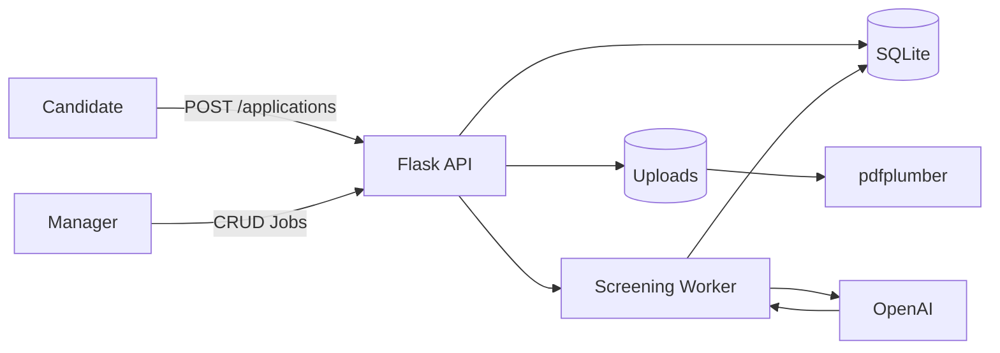

# AI Resume Screener (PoC)

A Proof-of-Concept backend system that automatically screens candidate resumes using AI.

The system allows:
* **Hiring managers** to create job openings
* **Candidates** to submit applications with PDF resumes
* **AI** to evaluate resumes against job descriptions

## Tech Stack

* **Python**
* **Flask**
* **SQLite**
* **OpenAI API**
* **pdfplumber**

## System Architecture



## Workflow

1.  **Candidate** uploads a PDF resume
2.  **Flask API** stores the file
3.  **Text** is extracted from the PDF
4.  **Application** is saved with status **pending**
5.  **Background worker** sends resume to **AI**
6.  **AI** returns **accepted** or **rejected**
7.  **Database** is updated with the result

## Installation

**git clone &lt;repo&gt;** **cd ai-resume-screener**

**Create environment:** `python3 -m venv venv`  
`source venv/bin/activate`

**Install dependencies:** `pip install -r requirements.txt`

**Set API key:** `export OPENAI_API_KEY=your_key`

**Create database:** `python3 create_db.py`

**Run server:** `python3 app.py`

**Server runs on:** `http://127.0.0.1:5000`

## API Examples

### Create Job
**POST /jobs**

```json
{
  "title": "Python Developer",
  "description": "Backend development",
  "requirements": "Flask, SQL"
}
```

### Submit Application
**POST /applications**

**Form-data:**
* `job_id`
* `applicant_name`
* `applicant_email`
* `resume` (PDF)

## Project Status

PoC implementation of an AI-assisted resume screening backend.